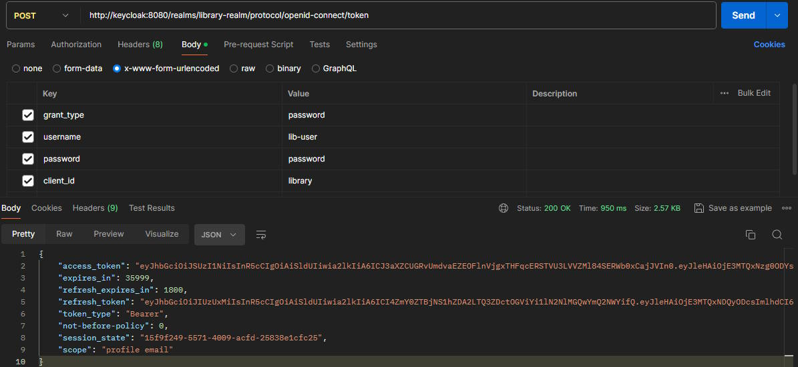
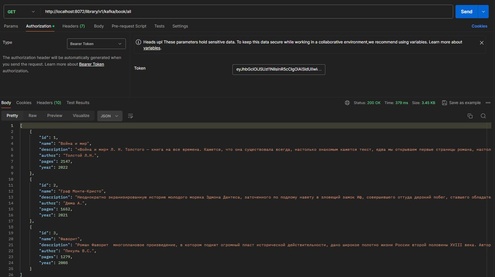
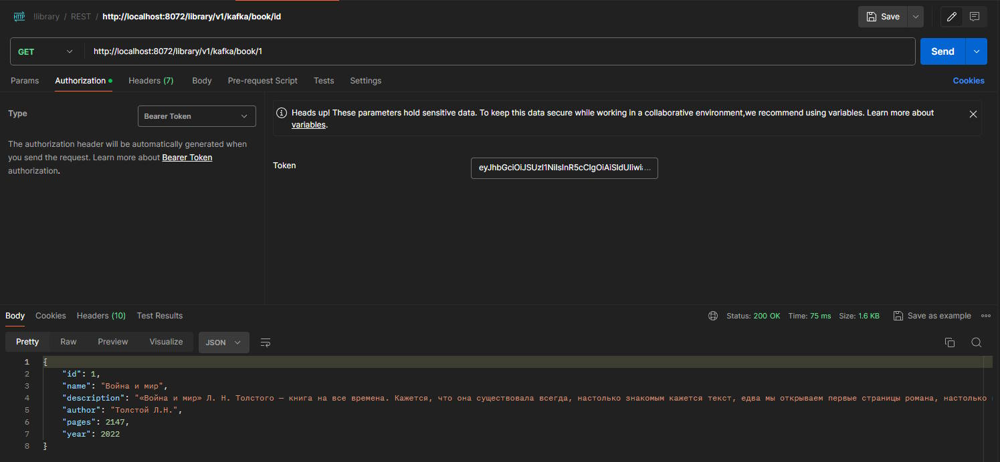
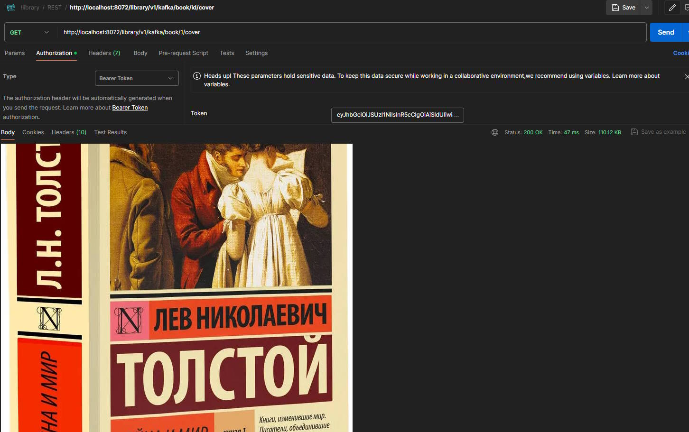

# microservices-library

## 
Оглавление

<ul>
<li><a href="#01">Описание проекта</a></li>
<li><a href="#02">Стек технологий</a></li>
<li><a href="#03">Требования к окружению</a></li>
<li><a href="#04">Сборка и запуск проекта</a>
    <ol type="1">
        <li><a href="#0401">Сборка проекта</a></li>
        <li><a href="#0402">Запуск проекта</a></li>
    </ol>
</li>
<li><a href="#05">Взаимодействие с приложением</a>
    <ol  type="1">
        <li><a href="#0501">Регистрация сайта</a></li>
        <li><a href="#0502">Авторизация</a></li>
        <li><a href="#0503">Регистрация URL</a></li>
        <li><a href="#0504">Переадресация</a></li>
        <li><a href="#0505">Статистика</a></li>
    </ol>
</li>
<li><a href="#06">Запуск проекта с использованием Docker</a>
<ol  type="1">
        <li><a href="#0601">Клонирование проекта</a></li>
        <li><a href="#0602">Сборка проекта в Docker image</a></li>
        <li><a href="#0603">Запуск проекта с использованием docker-compose</a></li>
        <li><a href="#0604">Работа с проектом</a></li>
</ol>
<li><a href="#contacts">Контакты</a></li>
</ul>

## 
Описание проекта

Сервис REST API, содержащий информацию о библиотечных книгах. 
Сервис разбит на микросервисы, которые в свою очередь делятся на группы:
 - Инфраструктурные микросервисы:
    1. Spring Cloud Configuration Server - сервис конфигурации. 
    2. Spring Cloud Eureka - сервис регистрации  обнаружения сервисов.
    3. Spring Cloud Gateway - сервис шлюза.
 - Микросервисы выполняющие запросы клиента:
    1. Rest service - сервис взаимодествия с клиентами.
    2. Library service - сервис работы с СУБД и хранилищем данных (PostgreSQL, Minio).
 - Хранилища данных:
    1. PostgreSQL - реляционное СУБД, хранит данные о книгах.
    2. Minio - хранилище обложек книг.
 - Брокер сообщений:
    1. ZooKeper - служба для координации работы брокера сообщений.
    2. Kafka - брокер сообщений.

Функционал:
- Аутентификация и авторизация с использованием Spring Security и Keycloak.
- Получение информации по всем книгам сервиса.
- Получение информации по книге и по обложке по id книги.

В приложении реализованы два вида endpoints, которые получают данные из внутреннего 
сервиса library-service:
- с ипользованием Kafka `http://localhost:8072/library/v1/kafka/*` 
- с использованием SOAP `http://localhost:8072/library/v1/soap/*`.

<a href="#contents">К оглавлению</a>

## 
Стек технологий

- Java 17
- Spring Boot 3, Spring Cloud
- Spring Security, Keycloak 
- Spring Data, PostgreSQL 15, Minio, Liquibase
- Maven, Lombok 
- Kafka, ZooKeeper, SOAP
- Docker, Docker Compose
- Javadoc, Checkstyle

<a href="#contents">К оглавлению</a>

## 
Требования к окружению

Java 17, Maven 3.8, Docker

<a href="#contents">К оглавлению</a>

## 
Сборка и запуск проекта

### 
1. Сборка проекта

Отдельно взятый сервис собирается в jar командой
`mvn clean package -DskipTests`

<a href="#contents">К оглавлению</a>

### 
2. Запуск проекта

Сборка и запуск проекта производится из корня проекта командой.
`docker-compose up`

<a href="#contents">К оглавлению</a>

## 
Взаимодействие с приложением

### 
1. Получение токена доступа

В приложении создана конфигурация для Keycloak, которая при развертывании в Docker, автоматически 
импортируется. Импортируемые параметры конфигурации:

| Параметр конфигурации |   Значение    |
|:---------------------:|:-------------:|
|         realm         | library-realm |
|       client_id       |    library    |
|         user1         |   lib-admin   |
|         user2         |   lib-user    |
|         role1         |     ADMIN     |
|         role2         |     USER      |

Для получения токена доступа необходимо направить на адрес сервиса Keycloak,  
`http://keycloak:8080/realms/library-realm/protocol/openid-connect/token`
заполнив параметры:

| Параметр запроса | Значение |
|:----------------:|:--------:|
|    grant_type    | password |
|    client_id     | library  |
|     username     | lib-user |
|     password     | password |

Пример:

В ответ Keycloak предоставит access_token и refresh_token. Access_token 
необходимо использовать при выполнении запросов в качестве Bearer Token.
Refresh_token необходим для обновления access_token по истечению срока его
действия.

<a href="#contents">К оглавлению</a>

### 
2. Запросы на получение информации

Получение всех книг:
`http://localhost:8072/library/v1/kafka/book/all`

Получение книги по id:
`http://localhost:8072/library/v1/kafka/book/1`

Получение обложки книги по id:
`http://localhost:8072/library/v1/kafka/book/1/cover`

<a href="#contents">К оглавлению</a>

## 
Запуск проекта с использованием Docker Compose

### 
1. Клонирование проекта

В CLI выполнить команду - `https://github.com/amemelyanov/microservices_library.git`. 
В текущей директории будет создана папка microservices_library, содержащая проект.

<a href="#contents">К оглавлению</a>

### 
2. Сборка проекта в Docker Compose

Для сборки проета используется команда - `docker-compose build`

<a href="#contents">К оглавлению</a>

### 
3. Запуск проекта с использованием Docker Compose

Для запуска собранного проекта используется команда - `docker-compose start`,
для остановки проекта - `docker-compose stop`.

<a href="#contents">К оглавлению</a>

## 
Контакты

&nbsp;&nbsp;

&nbsp;&nbsp;

<a href="#contents">К оглавлению</a>
